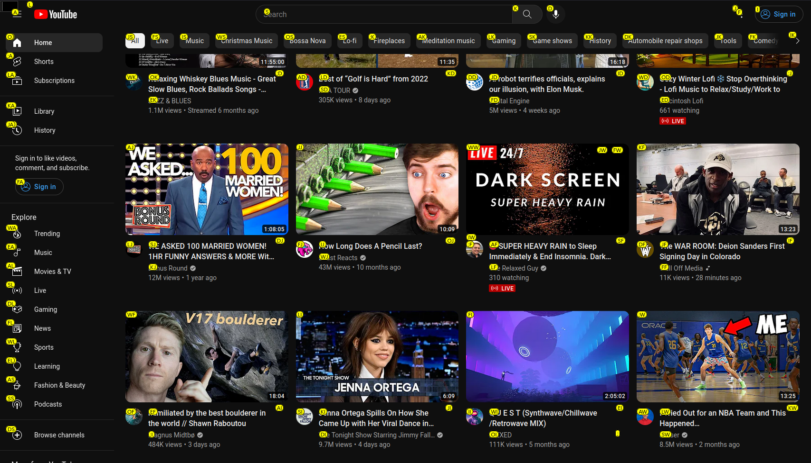
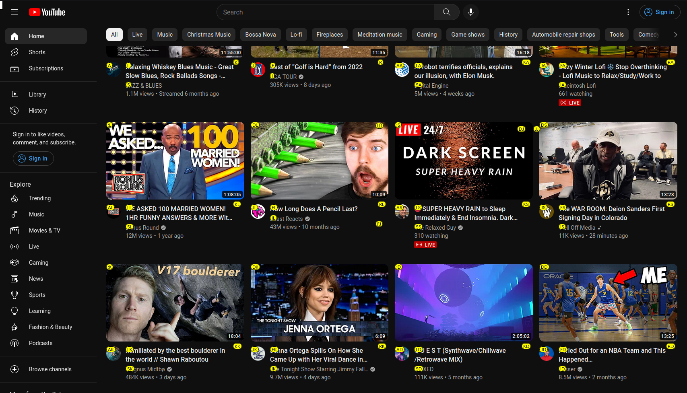

# mouselessV2

mouselessV2 is a fork of
[mortie/mouseless-plugin](https://github.com/mortie/mouseless-plugin),
with extra features and bug fixes.

## mouselessV2 vs mouseless

| Features                      | mouselessV2                  | mouseless                     |
| ----------------------------- | ---------------------------- | ----------------------------- |
| User Settings                 | Sync to your Firefox account | Saved locally to your machine |
| Key Bindings                  | Orignal key bindings         | Vim like key bindings         |
| Presets                       | :x:\*                        | :heavy_check_mark:            |
| On and Off Switch             | :x:\*                        | :heavy_check_mark:            |
| Clipboard Paste               | :heavy_check_mark:           | :x:                           |
| Duplicate Tab                 | :heavy_check_mark:           | :x:                           |
| Open New Window from link     | :heavy_check_mark:           | :x:                           |
| Open Private Window from link | :heavy_check_mark:           | :x:                           |
| Scroll to Top of Page         | :heavy_check_mark:           | :x:                           |
| Scroll to Bottom of Page      | :heavy_check_mark:           | :x:                           |

_\*See [Improvements and Fixes](#improvements-and-fixes) section for more information_

## Key Bindings

| Key Binding     | Action                                |
| --------------- | ------------------------------------- |
| ;               | Show blobs                            |
| Enter           | Click on element                      |
| \<Control>Enter | Open tab to link                      |
| \<Alt>u         | Duplicate tab                         |
| \<Shift>Enter   | Save link from element into clipboard |
| \<Alt>p         | Paste from clipboard to element       |
| Tab             | Focus on element                      |
| Escape          | Unfocus current element               |
| \<Alt>w         | Open a new window from link           |
| \<Alt>\<Shift>W | Open a private window from link       |
| \<Alt>j         | Scroll down                           |
| \<Alt>\<Shift>J | Scroll down fast                      |
| \<Alt>k         | Scroll up                             |
| \<Alt>\<Shift>K | Scroll up fast                        |
| \<Alt>g         | Scroll to the top of the page         |
| \<Alt>\<Shift>G | Scroll to the bottom of the page      |
| \<Alt>p         | Switch to the left tab                |
| \<Alt>n         | Switch to the right tab               |
| \<Alt>\<Shift>P | Move current tab to the left          |
| \<Alt>\<Shift>N | Move current tab to the right         |
| \<Alt>h         | Go one page back in history           |
| \<Alt>l         | Go one page forward in history        |

## Improvements and Fixes

### Improve Element Location Seeker

When using mouseless you'll notice as you scroll through a page some elements are not selectable,
such elements in a top bar, sidebar, or popup. mouseless finds every element's absolute location
based on document and checks if the element is within scrolling distance. While mouselessV2
finds every element's relative position to the viewport and checks if the element inside the
viewport.

| mouselessV2                          | mouseless                        |
| ------------------------------------ | -------------------------------- |
|  |  |

### mouseless Randomly Stops Working

This has been fixed with the reomval of On and Off Switch feature. mouselessV2 can still be turn
on and off in the about:addons settings.

### Presets

Presets were removed from mouselessV2. However, User Settings are now sync to your Firefox
account so you can make any changes to key binding and those changes will persist in all instances
of Firefox where you are login.

The reasoning of the removal was I need to come up with new key bindings for each present for
the new actions I added. That was be difficult work since I don't use any of other keyboard layouts.
Plus, the reomve has made the code much simpler without presets.

### Modifiers

mouselessv2 allows you use multiple modifiers for key bindings

e.g. `<Crtl><Alt><Shift>U` `<Crtl>u` `<Crtl><Shift>U` `<Crtl><Alt>u`

### YouTube

When using mouseless you will noticed videos were sometimes push up, covering up part of the video.
mouseless has always had problems with the space bar on YouTube as you can see
[here](https://github.com/mortie/mouseless-plugin/blob/master/ext/content.js#L578). That's fixed
for mouselessV2.
